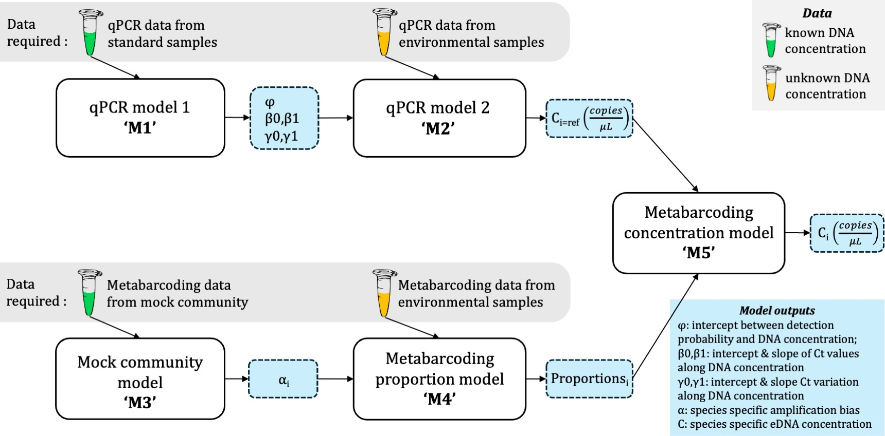

### Quick Introduction:

The **QM** R package provides a Bayesian statistical framework to estimate multiple species **DNA concentrations** from metabarcoding data. By utilizing information from qPCR from a single species and metabarcoding of a multi-species mock community it estimates the PCR amplification bias and thus estimates the absolute DNA concentrations of species present with Universal primers. It bridges the gap between metabarcoding read counts and biologically meaningful quantitative estimates (e.g., DNA copies per unit volume) by jointly modeling qPCR and metabarcoding observations.

Key Features:

1. **Estimates DNA concentration of metabarcoding data**. Going from metabarcoding reads to DNA copies per volume.
2. **Estimates conventional PCR amplification bias**. Accounts for species-specific amplification efficiencies, critical for accurate quantification in universal primer systems.
3. **Improves estimates of qPCR**. Includes a two-step model (continuous model and probability of detection model).

### Installation
```
# Install from GitHub (requires devtools):  
devtools::install_github("gledguri/QM")
```
------

### Quick start

```
# Load the R package
library(QM)

# Load the package dependencies
load_QM_packages()
```

[Click here to view a showcase in R on how to use the model (html)](https://html-preview.github.io/?url=https://github.com/gledguri/QM/blob/main/html/Showcase.html)





## Citation
If you use any part of this repository in your work, please cite:
- for using Models 1-2: Guri et al., [(2024)](https://onlinelibrary.wiley.com/doi/full/10.1002/ece3.70678). Quantifying the Detection Sensitivity and Precision of qPCR and ddPCR Mechanisms for eDNA Samples.

- for using Models 3–5: Guri et al., [(2024)](https://academic.oup.com/icesjms/article/81/8/1536/7728836). Predicting trawl catches using environmental DNA)